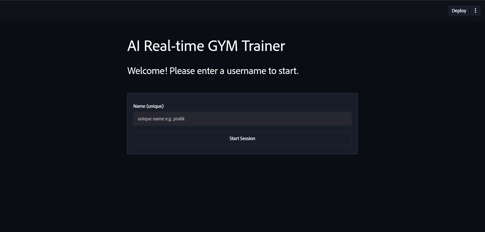
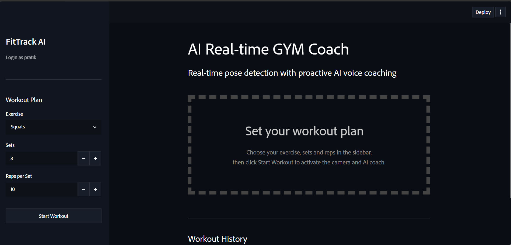
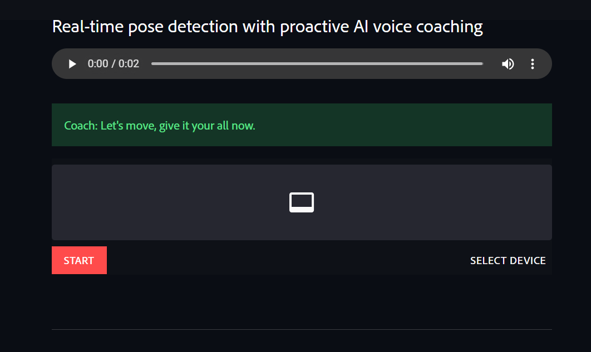
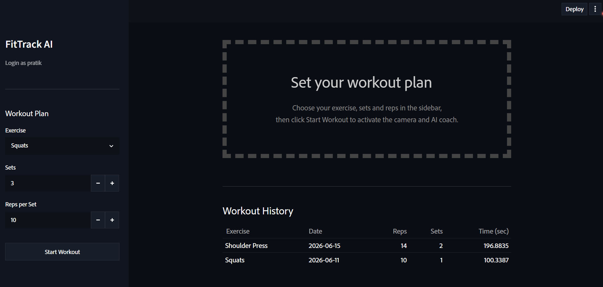

#  AI Gym Coach

An AI-powered real-time gym coach that uses Computer Vision, Pose Detection, and AI Voice Feedback to help users perform exercises with proper form and track their workout progress.

---

##  Features

###  Authentication

* User Login & Registration
* Secure Session Management

###  Real-Time Exercise Tracking

* Real-Time Pose Detection
* Exercise Form Analysis
* Live Workout Monitoring

###  Supported Exercises

* Squats
* Push-ups
* Shoulder Press
* Biceps Curls
* Lunges

###  AI Coaching

* AI-Powered Form Feedback
* Real-Time Voice Guidance
* Personalized Workout Assistance using Groq LLM

###  Progress Tracking

* Workout History
* Repetition Counter
* Set Tracking
* Performance Monitoring

###  User Interface

* Responsive UI
* Interactive Dashboard
* Real-Time Metrics Display

---

#  Tech Stack

## Frontend

* Streamlit
* HTML
* CSS

## Backend

* Python

## AI / Machine Learning

* MediaPipe
* OpenCV
* Groq LLM

## Database

* SQLite

## Libraries Used

* streamlit-webrtc
* gTTS
* pandas

---

#  Project Structure

```bash
AI-Gym-Coach/
│
├── LandingPage/
│
├── Main App/
│   ├── services/
│   ├── pages/
│   ├── static/
│   ├── tutorial-info/
│   ├── main.py
│   ├── requirements.txt
│
├── .gitignore
└── README.md
```

---

#  Installation

## Clone Repository

```bash
git clone <YOUR_REPOSITORY_URL>
cd ai-gym-coach
```

## Create Virtual Environment

```bash
python -m venv venv
```

### Windows

```bash
venv\Scripts\activate
```

### Linux / Mac

```bash
source venv/bin/activate
```

## Install Dependencies

```bash
pip install -r requirements.txt
```

---

#  Environment Variables

Create a `.env` file inside the project root:

```env
GROQ_API_KEY=your_groq_api_key
```

---

#  Run Application

Navigate to Main App:

```bash
cd "Main App"
```

Run Streamlit:

```bash
streamlit run main.py
```

Application will be available at:

```text
http://localhost:8501
```

---

# 📸 Screenshots

## Login Page



## Dashboard



## Workout Detection



## Workout History



#  How It Works

1. User logs into the application.
2. Selects workout type and workout plan.
3. Camera captures body movements in real time.
4. MediaPipe detects body landmarks.
5. OpenCV processes exercise posture.
6. AI Coach analyzes form.
7. Voice feedback is generated using Groq + gTTS.
8. Workout statistics are stored in SQLite.
9. Users can review workout history and performance.

---

#  Future Enhancements

* Personalized Workout Recommendations
* Nutrition Tracking
* AI Chat Trainer
* Multi-Language Voice Support
* Mobile Application
* Cloud Deployment
* Advanced Analytics Dashboard

---

#  Project Highlights

✔ Real-Time Pose Detection

✔ AI Voice Coaching

✔ Computer Vision-Based Form Analysis

✔ Workout Tracking & Analytics

✔ Responsive Streamlit Dashboard

✔ SQLite Database Integration

✔ Groq LLM Integration

---

#  Author

**Pratik Takale**

Data Scientist | AI-ML

GitHub: https://github.com/pratik-takale

LinkedIn: Add Your LinkedIn Profile

Portfolio Project
